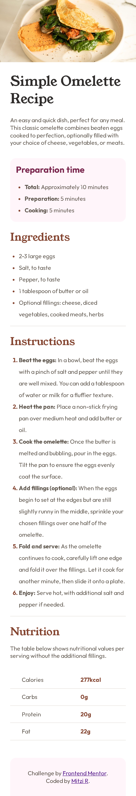

# Frontend Mentor - Recipe page solution

This is a solution to the [Recipe page challenge on Frontend Mentor](https://www.frontendmentor.io/challenges/recipe-page-KiTsR8QQKm). Frontend Mentor challenges help you improve your coding skills by building realistic projects. 

## Table of contents

- [Overview](#overview)
  - [The challenge](#the-challenge)
  - [Screenshot](#screenshot)
  - [Links](#links)
- [My process](#my-process)
  - [Built with](#built-with)
  - [What I learned](#what-i-learned)
  - [Continued development](#continued-development)
  - [Useful resources](#useful-resources)
- [Author](#author)

**Note: Delete this note and update the table of contents based on what sections you keep.**

## Overview

### Screenshot




### Links

- Solution URL: [](https://your-solution-url.com)
- Live Site URL: [Site](https://mitzir02.github.io/frontend-mentor.github.io/)

## My process

### Built with

- Semantic HTML5 markup
- CSS custom properties
- Flexbox
- Mobile-first workflow

### What I learned

Even though this is not my first hmtl-css page, I learned a couple of new things and I practice some others that I hadn't used in a while.

```html
<h1>Like the use of tables, which I haven't used in months.</h1>
<table>
        <tbody>
          <tr>
            <td class="td-title">Calories</td>
            <td class="td-info">277kcal</td>
          </tr>
       </tbody>
      </table>
```
```css
.list{
  list-style-type: disc;
}
```

### Continued development

I want to keep improving my css and html knowledge, and doing this kind of challenges will help me.

### Useful resources

- [Resource 1](https://developer.mozilla.org/en-US/docs/Web/CSS/list-style-type) - This helped me to remember how to apply a specific style for <table>.


## Author

- LinkedIn - [LinkedIn](https://www.linkedin.com/in/mitzi-rios/)
- Frontend Mentor - [@MitziR02](https://www.frontendmentor.io/profile/MitziR02)

